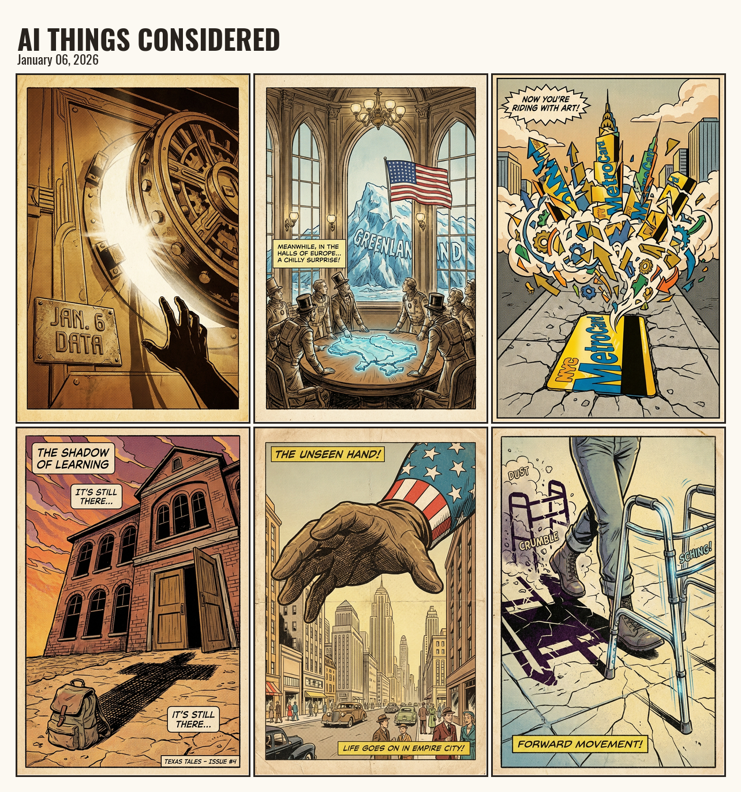
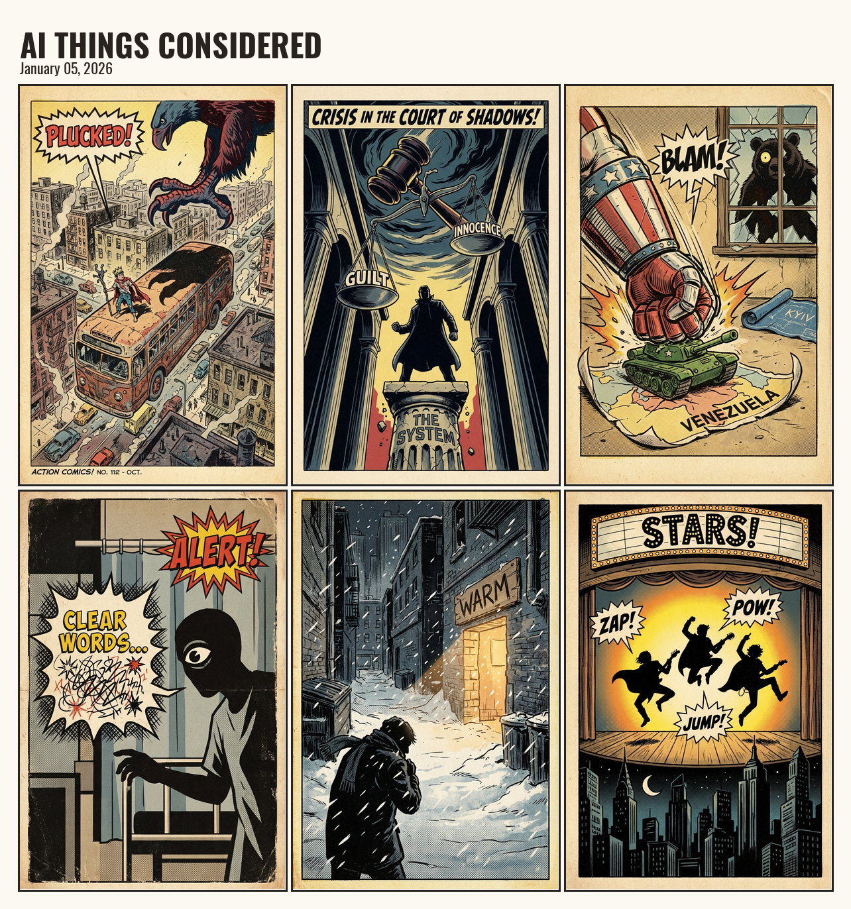

# AI Things Considered Archive

Daily comic strips generated from NPR's All Things Considered. Each comic visualizes 6 news stories in a vintage newspaper illustration style.

**Live at:** [benolsen.com](https://benolsen.com)

---

## Latest Comics

### January 6, 2026

### January 5, 2026

---

## About

Every day, an AI:
1. Reads the latest stories from NPR's All Things Considered
2. Selects 6 with visual potential
3. Generates image prompts in a vintage comic aesthetic
4. Renders each panel with Gemini
5. Composes them into a 3x2 grid

Click any panel on the website to read the original NPR story.

## Files

Each comic produces:
- `{date}.png` - The comic strip image
- `{date}.json` - Metadata with story titles, summaries, and NPR links
- `latest.json` - Points to the most recent comic

## Source

Generated by [AI-Things-Considered](https://github.com/benol5en/AI-Things-Considered)
